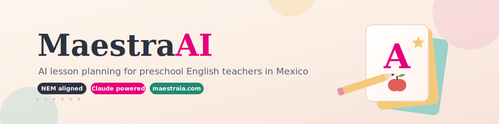
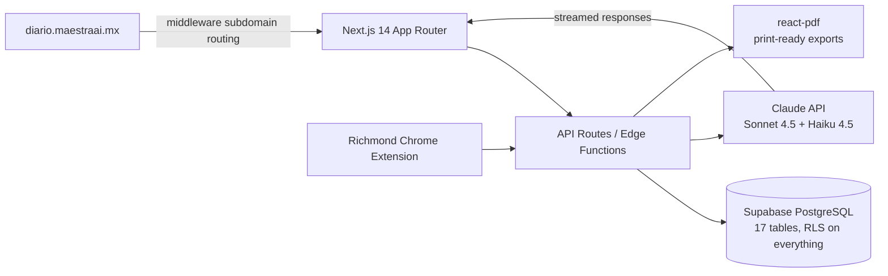

<p align="center">
  
</p>

<p align="center">
  <a href="https://maestraia.com"></a>
  
  
  
  
</p>

**MaestraAI is an all-in-one platform for preschool English teachers in Mexico.** It generates lesson plans, classroom materials, and student progress reports aligned with Mexico's national curriculum (Nueva Escuela Mexicana), so teachers spend their Sundays resting instead of formatting planeaciones.

---

## Why this exists

My mom, Alejandra, teaches Kinder 3 English in Mexico City. Every two weeks she loses an entire weekend writing a 10-day lesson plan by hand, formatting it for coordinators, and prepping flashcards with scissors and a printer. Multiply that by every preschool English teacher in the country.

MaestraAI started as a tool for one teacher. It's now built for all of them.

## What it does

**Lesson planning.** Generates full 10-day fortnight plans with Claude, aligned to NEM's 4 Campos Formativos and 7 Ejes Articuladores, respecting each school's fixed weekly schedule (Honores, Computación, Ed. Física). Plans are editable inline with vocabulary autocomplete and export to professional multi-page PDFs that pass coordinator and auditor review.

**Classroom materials.** AI-generated flashcards, worksheets, memory games, and curated YouTube playlists per lesson. Flashcards print 4 per page with cut lines, or project directly on the classroom screen. Includes an interactive Memory Match game kids play as a group.

**Student tracking.** A progress dashboard built around NEM's qualitative pedagogy. No numeric grades, ever. Evaluations track Logrado / En proceso / Requiere apoyo per student with progress charts and AI-assisted observations.

**Richmond integration.** Imports assignments and evaluations from the Richmond Learning Platform via CSV with fuzzy student matching, plus a Chrome extension for automatic sync.

**Teacher diary.** A free companion microsite at diario.maestraai.mx where any teacher can keep a reflective classroom diary and get AI-generated weekend summaries.

## How it's built



A few engineering decisions worth calling out:

- **RAG-grounded generation.** Lesson plans are grounded in official SEP curriculum documents (NEM framework, PRONI 2024, Programa Sintético) so output is compliant by design, not by prompt luck.
- **Row Level Security on all 17 tables.** Teacher data never crosses tenant boundaries. RLS is never disabled, no exceptions.
- **Claude is server-side only, always streamed.** No API keys touch the client, and teachers never stare at a blank screen during generation.
- **Pedagogy encoded as constraints.** The generator enforces rules like Letter & Number activities only on Tuesdays and number-sequence work only on Thursdays, because that's how real classrooms in this system run.
- **Qualitative by design.** The entire data model rejects numeric grades to match NEM evaluation philosophy.

## Tech stack

| Layer    | Tools                                                                                     |
| -------- | ----------------------------------------------------------------------------------------- |
| Frontend | Next.js 14 (App Router), TypeScript strict, Tailwind CSS, shadcn/ui, Framer Motion        |
| Backend  | Supabase (PostgreSQL + RLS), Edge Functions, Zod validation                               |
| AI       | Claude API (Sonnet 4.5 for generation, Haiku 4.5 for light tasks), RAG over SEP documents |
| PDF      | @react-pdf/renderer                                                                       |
| Quality  | Vitest, ESLint, Prettier, Husky pre-commit hooks                                          |
| Deploy   | Vercel, subdomain routing via middleware                                                  |

## Screenshots

<!-- TODO: add 2-3 screenshots or a short GIF: the planner, a generated flashcard set, the student dashboard -->

_Coming soon. In the meantime, the real thing is live at [maestraia.com](https://maestraia.com)._

<details>
<summary><b>🚀 Development setup</b></summary>

### Prerequisites

- Node.js 18+
- Supabase CLI
- Anthropic API key

### Installation

```bash
git clone <repository-url>
cd MaestraAI
npm install

cp .env.local.example .env.local
# Fill in: NEXT_PUBLIC_SUPABASE_URL, NEXT_PUBLIC_SUPABASE_ANON_KEY,
#          SUPABASE_SERVICE_ROLE_KEY, ANTHROPIC_API_KEY

supabase db push                          # migrations 001-008
psql $DATABASE_URL < supabase/seed.sql    # seed 129 vocabulary words
npm run dev
```

### Commands

```bash
npm run dev          # dev server on localhost:3000
npm run typecheck    # TypeScript compilation
npm run lint         # ESLint
npm test             # Vitest
npm run build        # production build
```

### Environment variables

```bash
NEXT_PUBLIC_SUPABASE_URL=
NEXT_PUBLIC_SUPABASE_ANON_KEY=
SUPABASE_SERVICE_ROLE_KEY=
ANTHROPIC_API_KEY=
NEXT_PUBLIC_FORCE_DIARY_SITE=true   # optional: test diary subdomain locally
```

</details>

<details>
<summary><b>📁 Project structure</b></summary>

```
MaestraAI/
├── app/
│   ├── (auth)/              # Login, register, 7-step onboarding
│   ├── (main)/
│   │   ├── planeaciones/    # Lesson planning
│   │   ├── alumnos/         # Student dashboard
│   │   ├── richmond/        # Richmond sync & CSV import
│   │   └── materiales/      # Materials & games
│   ├── api/                 # API routes
│   └── diary/               # Diary microsite (diario.maestraai.mx)
├── components/
│   ├── app/                 # App-specific components
│   ├── games/               # Memory Match, Flashcard Projector
│   └── ui/                  # shadcn/ui base
├── lib/
│   ├── supabase/            # Clients
│   ├── richmond/            # Richmond API & CSV parser
│   ├── materials/           # Material generation
│   └── prompts/             # Claude prompts
├── supabase/migrations/     # 001-008
├── docs/                    # PROGRESS.md, guides, archive
└── extension/               # Richmond Chrome extension
```

**Database:** 17 tables across core (schools, teachers, groups, students), planning (fortnights, lesson_plans, materials, vocabulary_items), Richmond integration (credentials, sync log, assignments, scores), observations (teacher_observations, teacher_diary, report_cards), and system (usage_logs, api_keys, group_teachers).

</details>

<details>
<summary><b>🗺️ Roadmap</b></summary>

- [x] Phase 1: Auth, onboarding, Richmond sync
- [x] Phase 2: AI lesson planner with NEM alignment and PDF export
- [x] Phase 3: Materials, games, student progress dashboard
- [ ] Teacher diary growth loop (diario.maestraai.mx)
- [ ] Pro tier (MXN 199/month)
- [ ] Worksheet photo grading (computer vision assist for evaluations)

</details>

## Status and contributing

MaestraAI is in active development with a real classroom as its first user. It's currently a private project and not accepting external contributions, but if you're a preschool English teacher in Mexico and want early access, reach out.

**Alan Ayala** · [alan.ayala.com.mx](https://alan.ayala.com.mx) · [LinkedIn](https://www.linkedin.com/in/alan-ayala-garcia/) · [@a.ayala.g](https://www.instagram.com/a.ayala.g/)

## License

Proprietary. All rights reserved.
